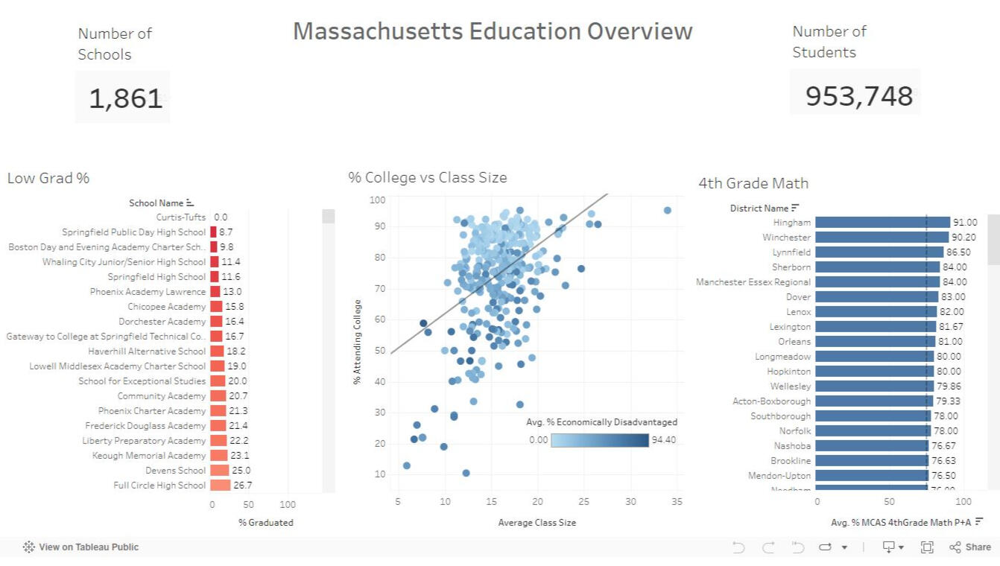

# Welcome to My Portfolio

---

### Learn About My Projects

#### [🍔 DoorDash Marketing Project](https://www.linkedin.com/pulse/unlocking-success-analyzing-doordash-data-excel-jercika-procel-c5bye/?trackingId=J%2Fv68MeBQ4yH0bSoGCGswQ%3D%3D)

<h3>Excel | Exploratory Data Analysis</h3>

In this project, I analyzed real-world marketing campaign data using Excel for both analysis and data visualization. I used VLOOKUPs, Pivot Tables, Scatter Plots, and Bar Charts to extract insights and identify trends. The final deliverable was a detailed write-up that provided actionable recommendations to assist the marketing team in planning their next campaign.

---

#### [🏫 Evaluating School Success with Tableau Project](https://www.linkedin.com/pulse/massachusetts-education-data-analysis-tableau-jercika-procel-qcdee/)

<h3>Tableau | Data Visualization</h3>
In this project, I created a dashboard to evaluate the performance of 1,800 different schools across hundreds of features. Using Scatter Plots, KPIs, Bar Plots, and Area Charts, I illustrated performance differences and trends. The accompanying write-up provided an in-depth analysis of the data. To ensure clarity and accessibility, I presented the dashboard to stakeholders through a recorded video presentation.

---

#### [💵 Financial Analysis of World Bank Loans](https://www.linkedin.com/pulse/how-world-bank-initiatives-shape-global-development-sql-based-procel-jxjge/)

<h3>SQL | Exploratory Data Analysis</h3>
In this project, I used SQL for exploratory data analysis, data-mining 1.31 million real bank transactions to identify financial outliers, patterns, and trends. I used various SQL clauses such as SELECT, WHERE, FROM, GROUP BY, AVG, MIN/MAX, SUM, and AND to thoroughly analyze the data. The insights gained from this analysis were compiled into a comprehensive written report that highlighted key findings and actionable insights.

---

#### [💪 Bellabeat Fitness Data Analysis with R Project](https://www.kaggle.com/code/jercikaprocel/bellabeat-capstone-project)

<h3>R | Exploratory Data Analysis</h3> 
In this project, I analyzed FitBit Fitness Tracker data comprising 18 .csv files. I utilized R packages such as tidyverse, lubridate, dplyr, ggplot2, and tidyr for data mining and visualizations. To explain the code and present the findings clearly, I created an R Notebook, providing a comprehensive overview of the analysis process and results.

---

